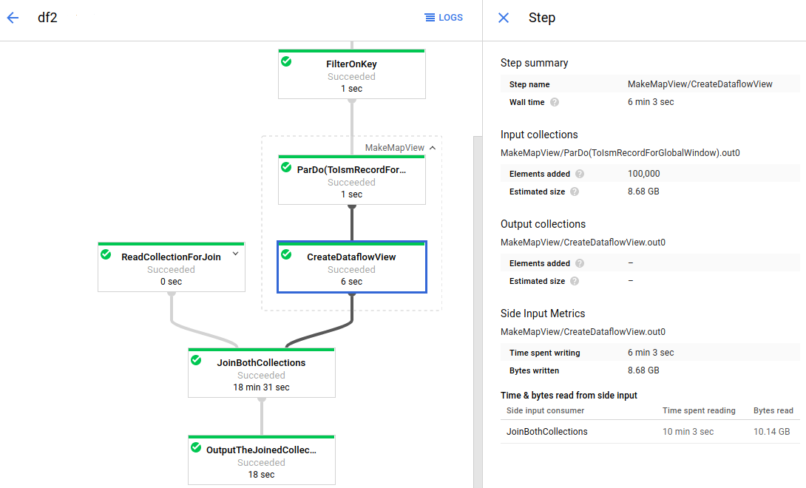

[top へ](../index.md)

# Overview

<!-- TOC -->

- [Overview](#overview)
    - [Beam の特徴](#beam-の特徴)
    - [Beam 固有の概念](#beam-固有の概念)
        - [Pipeline](#pipeline)
        - [PCollection](#pcollection)
        - [PTransform](#ptransform)
        - [I/O transform](#io-transform)
    - [Beam プログラミングの流れ](#beam-プログラミングの流れ)
        - [Pipeline インスタンスの作成](#pipeline-インスタンスの作成)
        - [データ初期化の定義](#データ初期化の定義)
        - [データ変換の定義](#データ変換の定義)
        - [外部出力の定義](#外部出力の定義)
        - [Pipeline の実行](#pipeline-の実行)

<!-- /TOC -->

## Beam の特徴

Beam は、並列処理パイプラインの定義を容易化するためのオープンソースです。

特徴は以下の通り。

1. `並列処理のためのロジックが実装不要`
    処理を行うワーカー (マシン) へのデータ配分等、物理的な処理はライブラリ側で自動的に行われる
    &rarr; データ処理のロジックのみに専念することが可能
1. `バッチ/ストリーミングの両方に対応`
    バッチ、ストリーミングパイプラインの両方を実装でき、Beam の仕掛け上、データ処理は同じ要領でコーディング可能
1. `対応データソースが多い`
    ローカル PC, GCP/AWS の各種ストレージサービスなど、様々なデータソースへの接続がサポート[^io]
1. `ポータビリティ`
    ソースコードの変更無しに、様々なプラットフォーム上で実行可能[^plat]

[^io]: https://beam.apache.org/documentation/io/built-in/
[^plat]: https://beam.apache.org/get-started/beam-overview/#apache-beam-pipeline-runners

## Beam 固有の概念

Beam では、並列処理パイプラインの実装を容易化するため、いくつかの抽象的な Beam に固有の概念を使います。

- `Pipeline`
- `PCollection`
- `PTransform`
- `I/O transform`

パイプラインの定義は、上記概念に沿って行うことになります。

### Pipeline

データの読み込み、変換、出力までの一連のタスクをひとまとめにした概念が `Pipeline` です。

`Pipeline` を作成する際、行うタスクのみでなく、パイプライン実行時に受け付けるオプション (読み込むファイルの名前等) の定義も行います。

### PCollection

データ変換処理の適応対象となる、データの集まりのことを `PCollection` といいます。

分散処理の都合上、`PCollection` 内の要素順序は制御ができません。そのため、各要素は "等価" となることが望ましいです。

- ○: 名字の集まり

```json
["佐藤", "鈴木", "田中", ...]
```

- △: 佐藤さんのプロパティ

```json
["佐藤", "32歳", "172cm", ...]
```

データサイズが有限 (全て集めることができる) かどうか、という意味で、バッチとストリーミングで扱うデータの性質は異なります。

Beam はどちらも `PCollection` として扱うものの、集計のような処理を行う場合は区別が必要となります。  
サイズが有限の `PCollection` は bounded、無限であるものは unbounded といいます。

### PTransform

`Pipeline` における各処理のステップが `PTransform` です。

Beam SDK に組み込まれている `PTransform` は数多くありますが、ユーザ定義の `PTransform` を作ることも可能です。

基本動作は、`PCollection`を入力として受け取り、処理結果を `PCollection` として出力します。

### I/O transform

データストレージへの入出力を行う `PTransform` となります。

I/O transform は `Pipeline` の先頭、または末尾にのみ記載可能です。  
(`PCollection` を入力に取らない、または出力しないという意味で、少し特殊な `PTransform` なため)

> **メモ**
上の制約から、「テキストファイルから処理するファイルのパスを動的に取得し、取得したファイルパスからデータを読み取る」といった処理は作りづらいです。
入出力を可変にするならば、`Pipeline`の実行時オプション経由で指定する方が簡単です。

## Beam プログラミングの流れ

Beam プログラミングの目標は、下図のような **Pipeline graph** をソースコードへ落とし込むことです。

>   
> [https://cloud.google.com/dataflow/docs/guides/using-monitoring-intf#side_input_metrics](https://cloud.google.com/dataflow/docs/guides/using-monitoring-intf#side_input_metrics)

コーディングレベルで、流れを説明します。

### Pipeline インスタンスの作成

まずは、`Pipeline` クラスをインスタンス化します。

パイプライン実行時に受け付けるオプション引数の定義も、この段階で行います。

### データ初期化の定義

`Pipeline` インスタンスに I/O Transform を使い、処理対象のデータを取得方法を定義します。

これにより、`Pipeline` インスタンスに関連付けられた、`PCollection` インスタンスが得られます。

(※ ソースコードに記載した値を使い、`PCollection` を作ることも可能)

### データ変換の定義

得られた `PCollection` インスタンスに対して、適用する処理 (`PTransform`) を定義していきます。

Beam SDK の標準メソッドで、できることを大雑把に触れておきます。

- データの変換、整形
- フィルター
- グループ化
- 集計

### 外部出力の定義

`PTransform` 適用後の `PCollection` に対して、 I/O transform を使い、データ出力先を定義します。

### Pipeline の実行

ここまでで、データ入出力、および一連の変換処理が定義された `Pipeline` インスタンスが出来ます。

`Pipeline` インスタンスのメソッド `run` を呼び出すことで、処理が起動されます。
