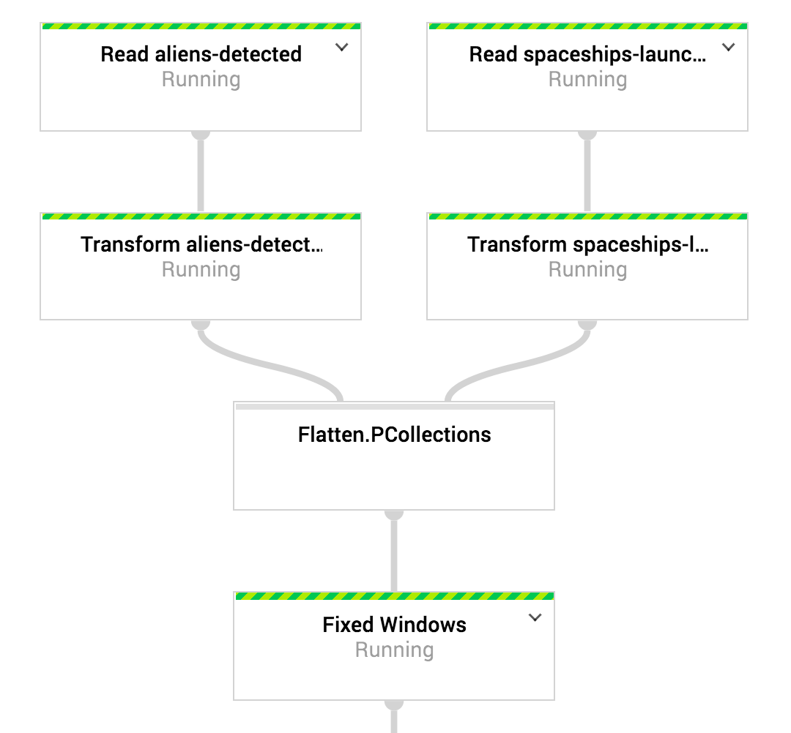

[戻る](../core.md)

# Partition
`Partition`は一つの`PCollection`を複数の`PCollection`に分割するためのメソッド。使用例としてはMLでdatasetの80%を訓練データに、20%を評価データに分割する、みたいな。

`Partition`で決める必要があるのは、

+ 分割のロジック
+ 分割数

の二つです。分割数を`PCollection`の要素数に応じて変えることはできないです。  
Pipelineの各ステップは逐次実行ではなく、処理の依存関係的に実行できる処理は、前段階のステップの終了を待たずに実行されます。そのため、要素数に応じて分割数を変える、といったことはできないと思われます。

>   
> [https://medium.com/google-cloud/infinite-backup-for-cloud-pub-sub-62021b679c51](https://medium.com/google-cloud/infinite-backup-for-cloud-pub-sub-62021b679c51)

分割のロジックは毎度のごとく、`PartitionFn`の実装で行います。  
Overrideするメソッドは`partitionFor`です。第一引数がInputの`PCollection`の要素、第二引数が分割数です (`Partition`をapplyするときに与えます)。  
このメソッドが返す整数に応じて分割先が変わりますが、戻り値は 0以上 numPartition未満である必要があります。

```java
import org.apache.beam.sdk.transforms.Partition.PartitionFn;

class MyPartitionFn implements PartitionFn<InputT> {
  @Override
  public int partitionFor(InputT item, int numPartition) { ... }
}
```

`PartitionFn`が作れれば、`Partition`をapplyします。

```java
import org.apache.beam.sdk.transforms.Partition;

int numPartition = ...;
PCollectionList<InputT> partitioned = input
    .apply(Partition.of(numPartition, new MyPartitionFn()));
```

分割後の各`PCollection`へのアクセスは、Listのようにgetメソッドを使います。

```
PCollection<InputT> pCollection = partitioned.get(0);
```

コードサンプルは[こちら](./codes/partition.md)です。

> #### memo
> [テンプレート](https://cloud.google.com/dataflow/docs/guides/templates/creating-templates?hl=ja)実行でなければ、Pipelineの実行時オプションとして分割数を変えることは可能です。