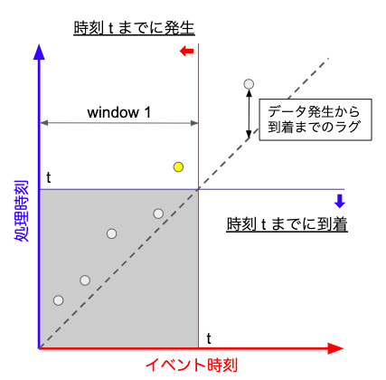

[topへ](../index.md)

# Trigger
**目次**

1. [概要](#overview)
2. [Built-inのtrigger](./built-in.md)
3. [集積モード](./accumulation-mode.md)
4. [Composite trigger](./composite-trigger.md)

## 概要
Window でデータをグループ化をした場合、Beam がいつ集計処理を発火するのか、を決めるのに **trigger** を使います。

前章の Window は要素のタイムスタンプに基づくグループ化なので、基本的にはデータの発生時刻（= イベント時刻）に基づいてデータが分割されます。

ですが遅延データなどを考えると、パイプラインにデータが届いた時刻（= 処理時刻）に基づいて、集計を行うデータを集める時間枠を考える必要があります。

少し詳しく考えてみます。下図はイベント時刻に対する処理時刻をのプロットです。仮に、パイプライン側でも window と同じ時間範囲でデータを集める、つまり集計を window の終わりに実行するとします。すると、処理を行う際にパイプラインに届いていないデータが発生し得ます（下図の黄色い点）。黄色い点も集計処理に入れたければ、パイプライン側で処理の開始を少し待つ必要があります。

 
図. イベント時刻に対して処理時刻をプロットしたグラフで、各点がデータを表します。

このような事情から Beam では **trigger** を使って、パイプライン側でデータを収集する時間枠（= **pane**）を指定します。時間範囲の指定が二つあってややこしく感じますが、このおかげで処理発火のタイミングを柔軟に設定できます。

1. 遅延データへの対応  
Window の終端以降に届いたデータも、集計処理に加えられます。
2. 処理の早期発火  
データが５つ届いたら処理を行うなど、Window を閉じる前でも処理を発火できます。

window を設定している場合、Beam の trigger のデフォルトの挙動は、Beam が window に対するデータが全て到着したと判断したタイミングで処理が発火されます。具体的には、window に watermark が渡るタイミングです。そして、これ以降に到着したこの window に対するデータは無視されます。

### Triggerの設計
以下 3点の何を重視するか、によって trigger を決めます。

1. **データの完全性**  
"Window に対するデータが全て揃っていること"、がどれだけ重要か。
2. **レイテンシ**  
全てのデータが届くまで、どれだけ処理発火を待つことができるか。
3. **コスト**  
コンピューテーションコストと金額です。Dataflow について説明する機会があれば...。

たとえば、「１分おきに更新すること」を重視するならば時間ベースの trigger になるでしょうし、「データが揃っていること」を重視するならば watermark ベースの default trigger がよいと思います。