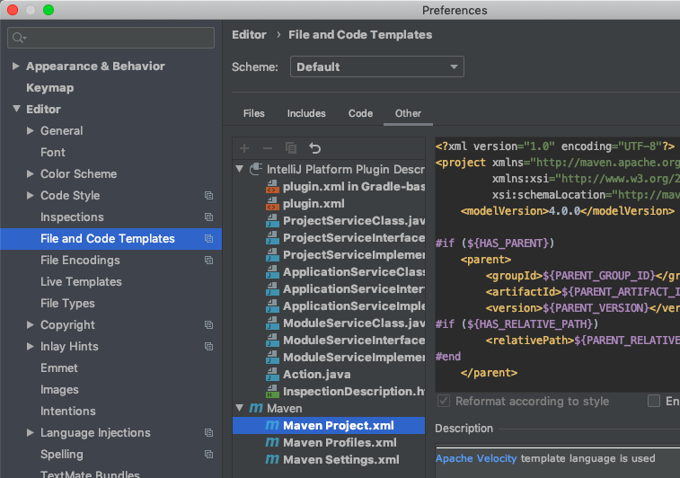

[topへ](../index.md)

# 準備編
目次

+ [Open JDKのinstall](#jdk)
+ [Apache Mavenのinstall](#maven)
+ [Jenvのinstall](#jenv)
+ [IntelliJのinstall](#intellij)

## <span class="lhead" id="jdk">Open JDKのinstall</span>
Java 8を使いたければ、Oracleの無償のJDKはもう利用不可。代替策として[AdoptOpenJDK](https://adoptopenjdk.net)のJava 8がLTSなので[^aoj]、こちらを利用します。
[^aoj]: [https://adoptopenjdk.net/support.html](https://adoptopenjdk.net/support.html)

## <span class="lhead" id="maven">Mavenのinstall</span>
Mavenは使用するライブラリの依存関係を解消してくれたり、ユニットテストが簡単に実行できたり、自作パッケージの公開ができたり...、と色々できるJavaのビルドツールです。
Homebrewでinstallするか、もしくは[公式サイト](https://maven.apache.org/download.cgi)からバイナリファイルをダウンロードしてください。

## <span class="lhead" id="jenv">jEnvのinstall</span>
pyenvとかのJava版です。Git、Homebrewでインストール可能ですが、Gitを使ってinstallする方法をまとめます。

```bash
$ git clone https://github.com/gcuisinier/jenv.git ~/.jenv
```

.bash_profileにjenvの設定を追加。

```bash
$ export JENV_ROOT="${HOME}/.jenv"
$ echo 'export PATH="${JENV_ROOT}/bin:$PATH"' >> ~/.bash_profile
$ echo 'eval "$(jenv init -)"' >> ~/.bash_profile
```

Jenvは割と優秀で、環境変数の自動設定、Mavenの設定とかができます。

```bash
$ jenv enable-plugin export
$ jenv enable-plugin maven
```

インストールが終わったら、

```bash
$ java -version
$ mvn -version
```

を行い、javaのversionが両者で一致してることとかをcheckしておしまいです。

## <span class="lhead" id="intellij">IntelliJのinstall</span>
IntelliJでMavenが使えるようになるまで、多少苦戦したのでメモです。
Mavenはpom.xmlでプロジェクトの管理をします (JDKのバージョンとか、依存ライブラリなど)。JDKのバージョンを頻繁に変えることはないかと思うので、デフォルトのpom.xmlをいじっておきます。


### defaultのpom.xmlの編集
毎回設定を変更するのは面倒なので、defaultのpom.xmlを編集しておきます。 

IntelliJのトップ画面から、Configure > Preferencesを選択します。


Editor > File and Code Templates > Otherを選びます。



その中にMaven project.xmlがあると思うので、ファイル末尾にちょい足しします。

```xml
... 中略 ...

    <groupId>${GROUP_ID}</groupId>
    <artifactId>${ARTIFACT_ID}</artifactId>
    <version>${VERSION}</version>
    
    <!-- ここから -->
    <properties>
        <maven.compiler.source>1.8</maven.compiler.source>
        <maven.compiler.target>1.8</maven.compiler.target>
    </properties>
    <!-- ここまでを追加 -->

    ${END}
</project>
```