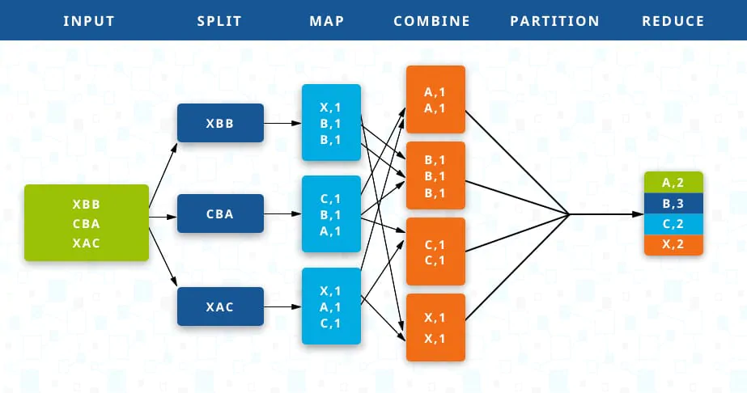

[戻る](../core.md)

# GroupByKey
`GroupByKey`は、inputの`PCollection`としてmultimap（key/valueペアであるが、同じkeyが登場し得る）を取り、同じkeyをもつものをグループ化したkey/valueペアの`PCollection`を返します。

再び[Map/Shuffle/Reduce](https://enterprisezine.jp/dbonline/detail/4440)モデルでいうと、Shuffleに似ているとのことです。  
下の画像だとCOMBINEとなっているところです。

>   
> [https://jp.talend.com/resources/what-is-mapreduce/](https://jp.talend.com/resources/what-is-mapreduce)

`GropuByKey`の使用例として、顧客の注文履歴データみたいのを考えます。一回の注文を`PCollection`の要素、注文者のIDをkey、名前や商品名などその他もろもろをvalueとします。  
同じ顧客からの注文は複数ありえますが、注文者のIDをkeyとして`GroupByKey`変換をしてあげると、顧客ごとにデータをまとめられることができます。

簡単なinput/outputの例を見て期待する動作を説明します。

**input**  
key/valueペアですが、keyに重複があります

```json
[
  { "cat": 1 },
  { "dog": 5 },
  { "and": 1 },
  { "jump": 3 },
  { "tree": 2 },
  { "cat": 5 },
  { "dog": 2 },
  { "and": 2 },
  { "cat": 9 },
  { "and": 6 }
]
```

**output**  
keyについてvalueがまとめられます。

```json
[
  { "cat": [1,5,9] },
  { "dog": [5,2] },
  { "and": [1,2,6] },
  { "jump": [3] },
  { "tree": [2] }
]
```

こういう例だと足し合わせたくもなりますが、`GroupByKey`はあくまでグループ化をするだけで、keyをuniqueにすることが目的です。  
足し合わせみたいのをしたければ、`Combine`を使います。

## コードサンプル
まず、inputの`PCollection`を作ります。  
Beamではkey/valueペア用に、`KV<K,V>`型が用意されています。Kがkeyの型、Vがvalueの型です。`KV.of`で一つのkey/valueペアが作れます。

```java
import java.util.Arrays;
import java.util.List;
import org.apache.beam.sdk.Pipeline;
import org.apache.beam.sdk.transforms.Create;
import org.apache.beam.sdk.values.KV;
import org.apache.beam.sdk.values.PCollection;

// ... 中略 ...

List<KV<String, Integer>> input =
    Arrays.asList(KV.of("cat", 1), KV.of("dog", 5), ...);

Pipeline pipeline = Pipeline.create();
PCollection<KV<String, Integer>> col = pipeline.apply("CreateInput",
    Create.of(input).withCoder(KvCoder.of(StringUtf8Coder.of(), BigEndianIntegerCoder.of())));
```

`KV`型の`PCollection`さえ作れてしまえば、`GroupByKey`をapplyするだけです。

```java
import org.apache.beam.sdk.transforms.GroupByKey;

// ... 中略 ...

col.apply("ApplyGroupByKey", GroupByKey.create());
```

動作するコードの全体は、[こちら](./codes/gbk.md)を参照してください。